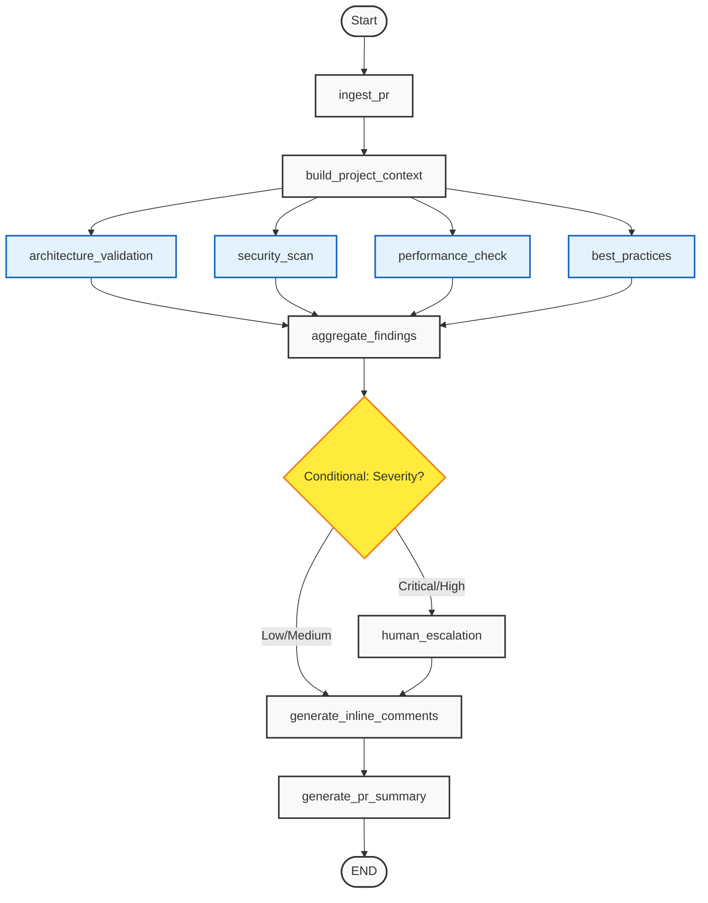

# Code Review Agent - V2 Specification

## Overview
The V2 Code Review Agent transitions from a basic, single-file snippet reviewer (V1) to a comprehensive, **Project-Level Pull Request (PR) Reviewer**. This agent doesn't just look at isolated functions; it understands context, cross-file dependencies, architectural patterns, and generates production-ready inline comments suitable for platforms like GitHub or GitLab.

## Core Objective
Analyze multi-file changes (diffs), understand their impact on the broader repository, validate against high-level project architectures, and provide actionable, context-aware PR feedback.

---

## Architectural Evolution: V1 vs V2

### 🔴 DELETED NODES (Removed from V1)
These nodes were deemed inefficient for an advanced LLM agent or too simplistic for professional workflows:
1. **`syntax_analysis`**: Syntax and basic style formatting (indentation, typos) will be delegated to traditional static linters (e.g., Ruff, ESLint) in CI pipelines. The LLM's tokens are better spent on deep logic.
2. **`parse_input`**: Deleted because it only handled a single string of code.
3. **`educational_content`**: Deleted. Generic tutorial-style explanations are not suitable for professional PR workflows.

### 🟢 NEW NODES (Introduced in V2)
These nodes add project context and specific PR capabilities:
1. **`ingest_pr` (Replaces `parse_input`)**: Ingests multi-file git diffs, PR titles, descriptions, and commit messages.
2. **`build_project_context`**: Maps dependencies. If modified file A is used by file B, this node fetches file B as context so the LLM understands the downstream impact.
3. **`architecture_validation`**: Validates the PR against project-wide architectural rules (e.g., "Routers must not directly execute SQL queries").
4. **`generate_inline_comments` (Replaces `educational_content`)**: Generates actionable, file-and-line-specific comments mapped strictly to the diff.

### 🟡 UPGRADED NODES (Kept from V1, but enhanced)
1. **`security_scan`**: Now looks for cross-file vulnerabilities (e.g., tracing unsanitized user input from a router down to a new database service).
2. **`performance_check`**: Now evaluates systemic performance impacts (e.g., catching potential N+1 database querying issues introduced across services).
3. **`best_practices`**: Now evaluates standard PR practices (e.g., checking if tests were included for the new logic).
4. **`generate_report` -> `generate_pr_summary`**: Upgraded to output the final "Approve" or "Request Changes" overarching summary for the PR.

---

## V2 State Graph Pipeline (As Implemented)

The `LangGraph` pipeline executes across a strongly typed `PRReviewState`. It uses a **Map-Reduce Fan-out/Fan-in** architecture to conduct analysis in parallel and merge results.

**Streaming Execution Model:** The pipeline is designed to emit real-time state updates. Instead of holding the HTTP connection open until the entire graph finishes (which could take 10-20 seconds), the backend streams execution states (`astream` or Server-Sent Events). This allows the frontend to receive partial results and per-node **execution times** as soon as individual nodes in the parallel verification layer complete.

### Core Processing Nodes
1. **`ingest_pr`**: Sequential entry node. Reads the diff and builds internal representations.
2. **`build_project_context`**: Augments the state by fetching related files/context.
3. **Parallel Verification Layer** (Simultaneous Execution):
   - **`architecture_validation`**: Validates against custom project rules.
   - **`security_scan`**: Hunts for vulnerabilities.
   - **`performance_check`**: Highlights performance/I/O issues.
   - **`best_practices`**: Enforces SOLID/DRY principles on PRs.
   *(Note: The output arrays use `operator.add` in the state dict to safely merge findings from parallel nodes into lists.)*
4. **`aggregate_findings`**: Fan-in node. Merges all parallel outputs into a unified list of issues (`all_findings`) to avoid duplicate feedback.
5. **Conditional Routing (`route_by_severity`)**:
   - If `severity_level` == "critical" -> Escalate to `human_escalation`.
   - Else -> Proceed to `generate_inline_comments`.
6. **`generate_inline_comments`**: Formats non-critical issues into line-specific feedback matching GitHub/GitLab JSON specifications.
7. **`generate_pr_summary`**: Generates the final PR overview, rendering a `pr_summary` object with the approval status and ending the graph.

### API Surface
Three primary endpoints are exposed (or planned) in `app/api/routers/review.py`:
- `POST /review/analyze`: Backward compatibility endpoint. Expects a `github_url` payload (e.g., raw blob), synthesizes a dummy git diff, and runs it through the V2 PR pipeline to retrieve findings for a single file.
- `POST /review/pr`: The primary V2 endpoint. Accepts a comprehensive `PRReviewRequest` (git_diff, pr_title, description, and commit_messages). **Streaming capabilities:** This endpoint (or a paired SSE/WebSocket endpoint) streams back `PRReviewResponse` chunks as nodes complete, allowing the frontend to render node-specific execution times and incremental `inline_comments` without waiting for the `generate_pr_summary` node to finish.

### 🟡 Future Expansion: Directory-Level Reviews
A planned architectural expansion will introduce `POST /review/directory`. 
- **Goal:** Allow users to submit a link to a GitHub *folder* (e.g., `https://github.com/user/repo/tree/main/app/services`).
- **Mechanism:** The backend will recursively fetch all supported source files within that directory. It will combine them and feed them to the `ingest_pr` node as a synthetic "whole-folder diff" or specialized multi-file context array. 
- **Challenge:** LLM Token limits. Passing entire directories requires either robust chunking, localized Vector DB (RAG) lookups, or high-context models (e.g., GPT-4o 128k context) to avoid blowing up the token window.

### Visual State Graph Flow

## Integration & Context 
In V2, the application will require robust integration with Vector Stores or abstract syntax tree (AST) parsers to efficiently power the `build_project_context` node, ensuring the LLM isn't blindly guessing about external file structures.

## Prompt Modularization & Upgrades
The transition to V2 necessitates an upgrade to the prompt configurations. Since V2 shifts from single-file analysis to multi-file PR-level reviews, the underlying LLM prompts must evolve concurrently:

1. **Context-Aware Templates**: Prompts (e.g., `security_scan.yml`, `best_practices.yml`) will be updated to accept multiple file contexts. Instead of `{{code}}`, the new templates will interpolate `{{git_diff}}` and `{{related_files_context}}`.
2. **Output Formatting**: The `generate_inline_comments.yml` prompt will be heavily customized to output JSON structures that adhere precisely to GitHub/GitLab inline review APIs, including `path`, `position`, `line`, and `body`.
3. **Architectural Directives**: A new `architecture_validation.yml` prompt will be introduced. This prompt acts as the rule engine, taking the project's static markdown rules (e.g., "Always use dependency injection") and verifying the PR against them.

This modular YAML architecture allows prompts to be tuned independently without altering the core Python execution logic.
